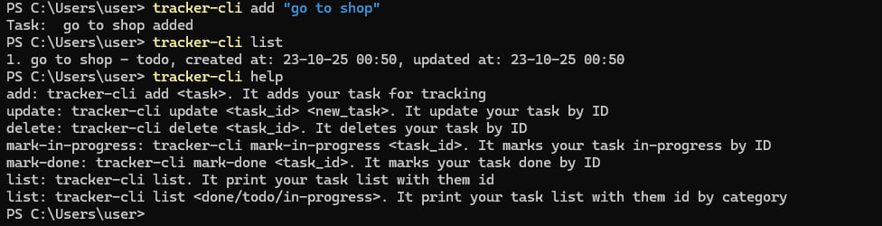

# tracker-cli

`tracker-cli` — это консольный менеджер задач, написанный на Go. Программа позволяет создавать, обновлять, удалять и отслеживать задачи с поддержкой статусов `todo`, `in-progress` и `done`. Все задачи сохраняются в JSON-файл, что позволяет сохранять данные между запусками.

---

## Структура проекта

```
tracker-cli/
│
├─ cmd/
│ └─ main.go           # Точка входа приложения
│
├─ internal/
│ ├─ cli/
│ │ └─ cli.go          # Обработка аргументов командной строки и вызов методов Tracker
│ ├─ tasks/
│ │ ├─ task.go         # Структура Task
│ │ ├─ services.go     # Логика управления задачами (Tracker)
│ │ └─ storage.go      # Работа с JSON-хранилищем (FileStorage)
```

---

## Установка

1. Склонируйте репозиторий:

```bash
git clone <репозиторий>
```

2. Перейдите в папку проекта и соберите исполняемый файл:

```bash
cd tracker-cli
go build -o tracker-cli.exe ./cmd
```

3. (Опционально) Добавьте папку с tracker-cli.exe в PATH, чтобы вызывать программу из любого места:

```powershell
$env:Path += "путь до папки с exe"
```

---

## Использование

### Справка

```bash
tracker-cli help
```

Выводит список доступных команд:

- `add <task>` — добавляет новую задачу
- `update <task_id> <new_task>` — обновляет описание задачи по ID
- `delete <task_id>` — удаляет задачу по ID
- `mark-in-progress <task_id>` — помечает задачу как "in-progress"
- `mark-done <task_id>` — помечает задачу как "done"
- `list` — выводит список всех задач
- `list <done/todo/in-progress>` — выводит задачи по категории

### Примеры

Добавление новой задачи:

```bash
tracker-cli add "Go to the gym"
```

Обновление задачи:

```bash
tracker-cli update 1 "Go shopping"
```

Удаление задачи:

```bash
tracker-cli delete 1
```

Пометить задачу как в процессе:

```bash
tracker-cli mark-in-progress 2
```

Пометить задачу как выполненную:

```bash
tracker-cli mark-done 2
```

Список задач:

```bash
tracker-cli list
tracker-cli list done
```

---

## Особенности

- Все задачи хранятся в JSON-файле: `C:\Users\user\bin\tracker-cli\tasks.json`
- Автоматическое создание файла и папки, если их нет
- Каждая задача имеет:
    - `ID` — уникальный идентификатор
    - `Description` — описание задачи
    - `Status` — статус (`todo`, `in-progress`, `done`)
    - `CreatedAt` — время создания в формате `dd-mm-yy hh:mm`
    - `UpdatedAt` — время последнего обновления



